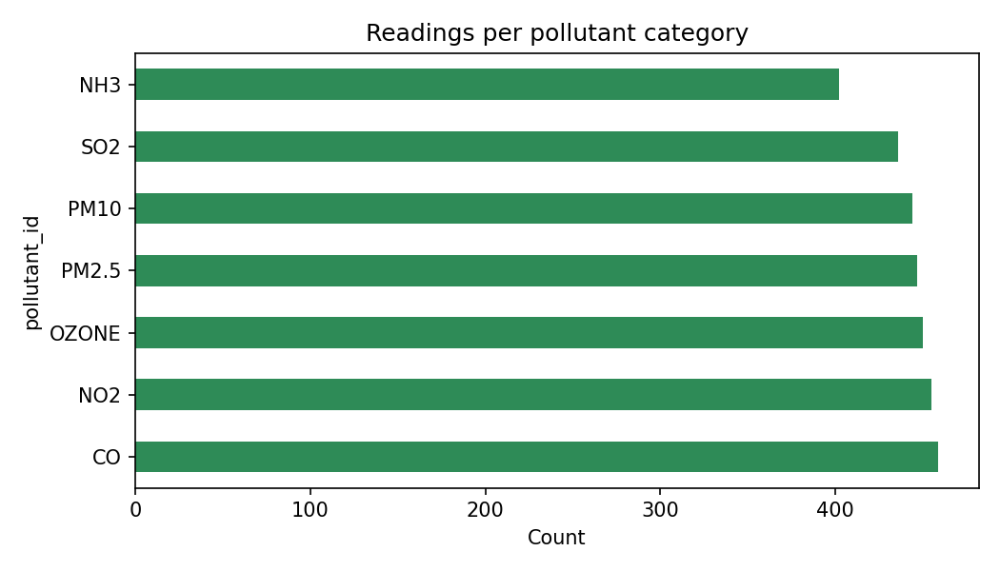
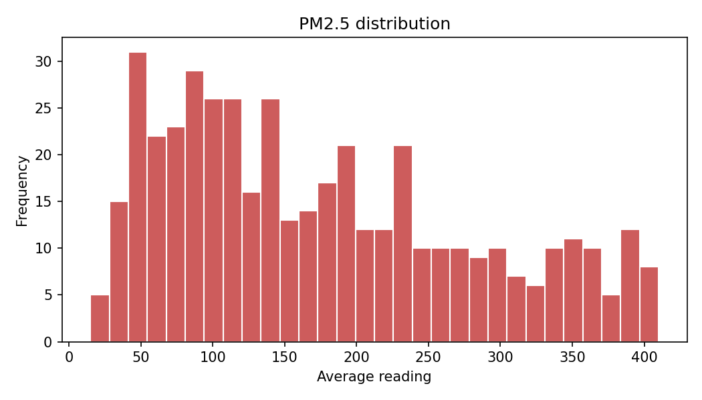
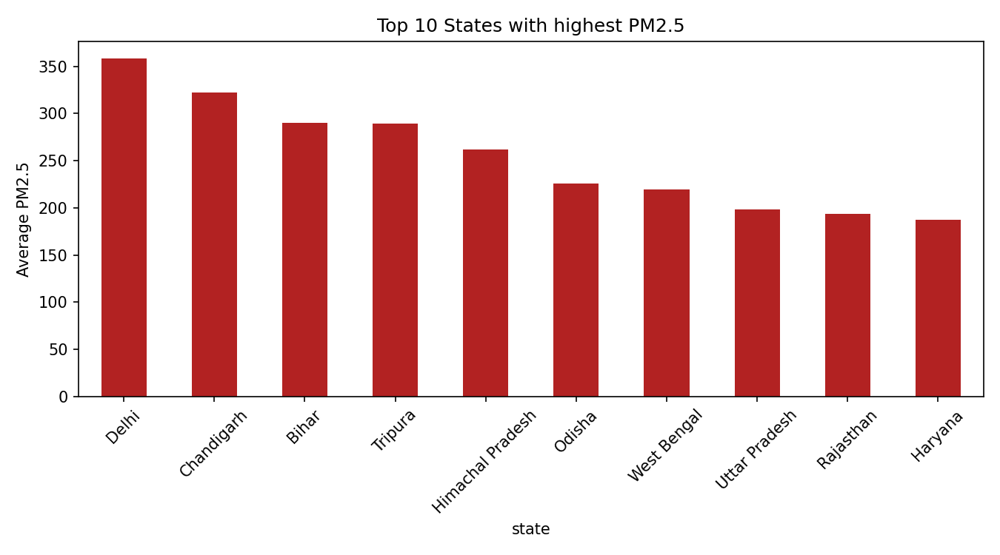
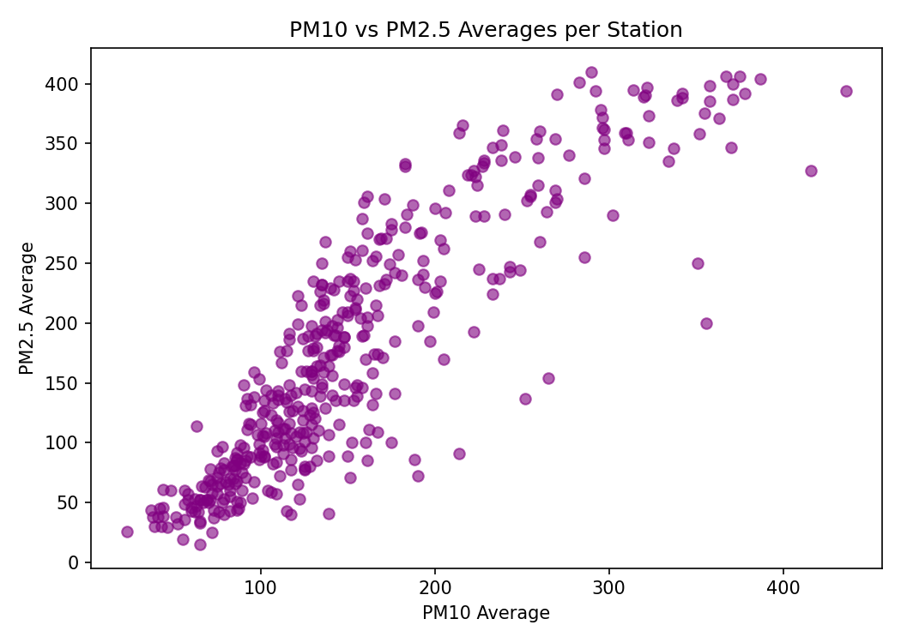

# Air Quality Analysis in India (EDA Project)

**Industry Name:** Environmental Data Analysis

## Problem Statement
The project aims to analyze air quality data from various monitoring stations across India to determine pollution levels and identify the most polluted states and cities based on critical pollutants like PM2.5 and PM10.

## Proposed Solution / Analysis Questions
Using Python data analysis, the objective is to clean and explore the data, calculate summary statistics, determine average pollutant values by state and city, evaluate the percentage of PM2.5 readings in the "Poor" category (>90), and analyze the statistical correlation between PM2.5 and PM10 levels.

## Dataset Name
Air Quality Data (Snapshot of Jan 30, 2024)

## Dataset Source
Open Government Data Portal (data.gov.in)

## Tools & Technologies
* Python
* Jupyter Notebook
* NumPy
* Pandas
* Matplotlib
* Seaborn
* SciPy

## Project Workflow
Industry Selection → Problem Identification → Dataset Collection → Data Cleaning → Data Transformation → Data Analysis → Data Visualization → Insights → Recommendations

## Data Analysis & Visualization
The following analyses and visualizations were performed in the project:
* **Category Analysis:** Number of readings per pollutant category.
* **Distribution Analysis:** Histogram showing the frequency distribution of PM2.5 average readings.
* **Trend Analysis:** Bar chart identifying the Top 10 States with the highest average PM2.5 levels.
* **Correlation Analysis:** Scatter plot evaluating the relationship between PM10 and PM2.5 averages per station.

## Key Insights
* Calculated summary statistics and average pollutant values across the dataset.
* Identified the Top 10 states and cities suffering from the highest average PM2.5 pollution.
* Computed the exact number and percentage of PM2.5 readings that exceeded the safe threshold (above 90).
* Discovered the Pearson correlation coefficient between PM2.5 and PM10 levels across monitoring stations.

## Recommendations
* **Targeted Interventions:** Focus pollution control measures and funding primarily on the top 10 most polluted states and cities identified in the trend analysis.
* **Increased Monitoring:** Enhance continuous monitoring and issue public health warnings in areas where PM2.5 readings frequently exceed the threshold of 90.
* **Policy Formulation:** Formulate state-specific environmental policies targeting the primary sources of PM2.5 and PM10 emissions.

## Visualization Screenshots

### Category Analysis


### Distribution Analysis


### Trend Analysis


### Correlation Analysis


## Project Folder Structure

```text
Air-Quality-EDA/
│
├── README.md
│
├── Dataset/
│   ├── dataset.csv
│   └── cleaned dataset.csv
│
├── Notebook/
│   └── Data_Analysis_EDA.ipynb
│
├── Python/
│   ├── data_loading.py
│   ├── data_cleaning.py
│   ├── exploratory_analysis.py
│   └── data_visualization.py
│
└── Visualizations/
    ├── category_analysis.png
    ├── distribution_analysis.png
    ├── trend_analysis.png
    └── correlation_analysis.png
```

## Author
* **Name:** Ajmal
* **Student ID:** AF05320136
* **Organization:** Anudip Foundation
* **Course:** AIML
* **Batch Code:** ANP-D744
